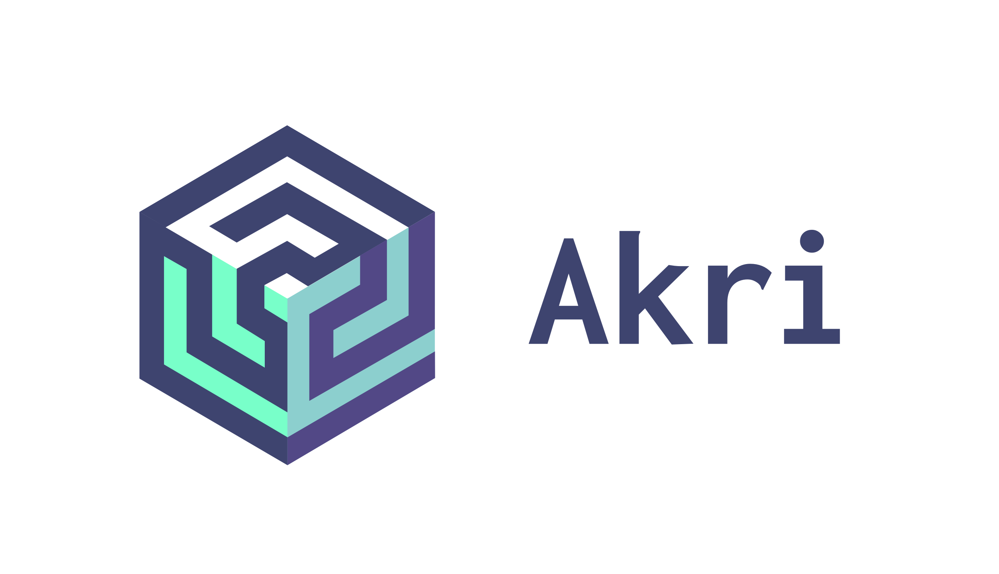

# Home

## What is Akri?

Akri is a Kubernetes Resource Interface that lets you easily expose heterogeneous leaf devices (such as IP cameras and
USB devices) as resources in a Kubernetes cluster, while also supporting the exposure of embedded hardware resources
such as GPUs and FPGAs. Akri continually detects nodes that have access to these devices and schedules workloads based
on them.

Simply put: you name it, Akri finds it, you use it.

## Why Akri?

At the edge, there are a variety of sensors, controllers, and MCU class devices that are producing data and performing
actions. For Kubernetes to be a viable edge computing solution, these heterogeneous “leaf devices” need to be easily
utilized by Kubernetes clusters. However, many of these leaf devices are too small to run Kubernetes themselves. Akri is
an open source project that exposes these leaf devices as resources in a Kubernetes cluster. It leverages and extends
the Kubernetes [device plugin
framework](https://kubernetes.io/docs/concepts/extend-kubernetes/compute-storage-net/device-plugins/), which was created
with the cloud in mind and focuses on advertising static resources such as GPUs and other system hardware. Akri took
this framework and applied it to the edge, where there is a diverse set of leaf devices with unique communication
protocols and intermittent availability.

Akri is made for the edge, **handling the dynamic appearance and disappearance of leaf devices**. Akri provides an
abstraction layer similar to [CNI](https://github.com/containernetworking/cni), but instead of abstracting the
underlying network details, it is removing the work of finding, utilizing, and monitoring the availability of the leaf
device. An operator simply has to apply a Akri Configuration to a cluster, specifying the Discovery Handler (say ONVIF)
that should be used to discover the devices and the Pod that should be deployed upon discovery (say a video frame
server). Then, Akri does the rest. An operator can also allow multiple nodes to utilize a leaf device, thereby
**providing high availability** in the case where a node goes offline. Furthermore, Akri will automatically create a
Kubernetes service for each type of leaf device (or Akri Configuration), removing the need for an application to track
the state of pods or nodes.

Most importantly, Akri **was built to be extensible**. Akri currently supports ONVIF, udev, and OPC UA Discovery
Handlers, but more can be easily added by community members like you. The more protocols Akri can support, the wider an
array of leaf devices Akri can discover. We are excited to work with you to build a more connected edge.

## Documentation
Akri's documentation is divided into six sections:

1. 📘 [User Guide](./user-guide/getting-started.md): Documentation for Akri users.
1. 🔎 [Discovery Handlers](./discovery-handlers/onvif.md): Documentation on how to configure Akri using Akri's currently supported Discovery Handlers
1. 🚀 [Demos](./demos/usb-camera-demo.md): End-to-End demos that demostrate how Akri can discover and use devices. Contain sample brokers and end applications.
1. ⚙️ [Architecture](./architecture/architecture-overview.md): Documentation that details the design and implementation of Akri's components.
1. 💻 [Development](./development/development.md): Documentation for Akri developers or how to build, test, and extend Akri.
1. 🎉 [Community](./community/roadmap.md): Information on what's next for Akri and how to get involved! 
