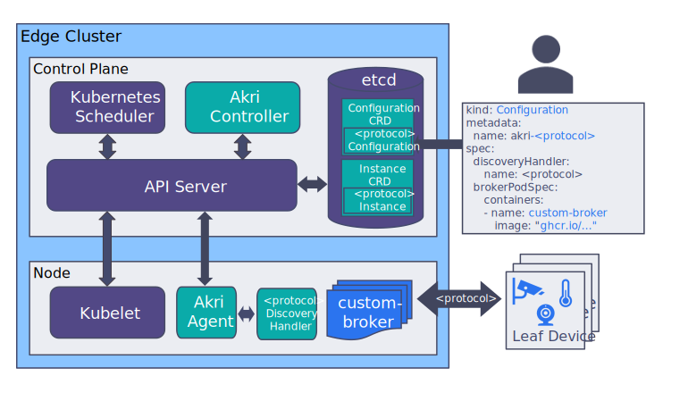
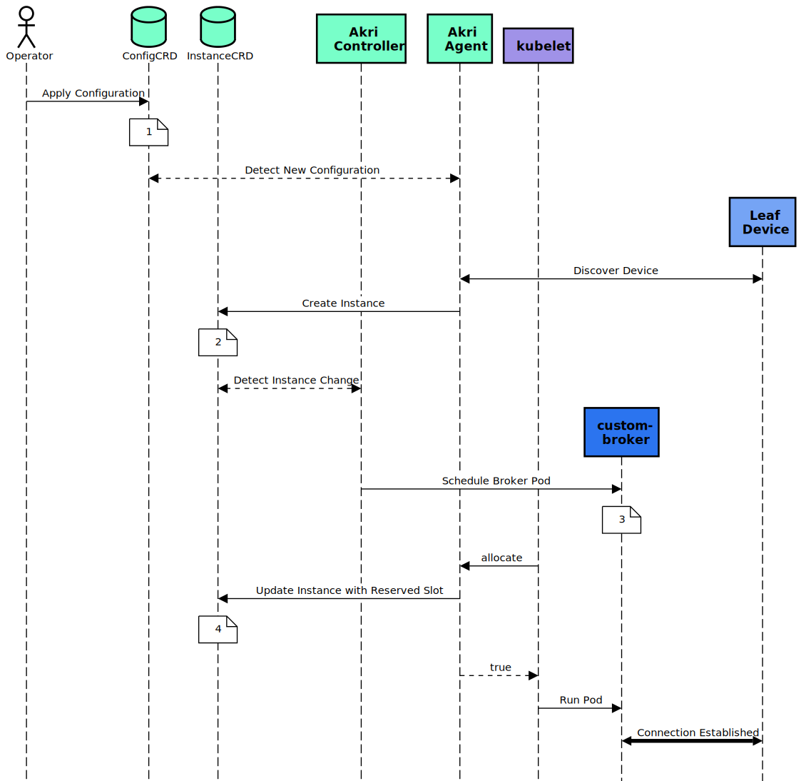

# Overview

This document will describe Akri's components. The word "resource" is used to describe what is being searched for and ultimately utilized. Resources offer services. For example, they can be USB or IP cameras, which serve video frames, or GPUs, which provide computation. They can be locally attached, embedded, or remotely accessible to worker nodes, such as USB devices, GPUs, and IP cameras, respectively.

## How Akri Works
Akri's architecture is made up of five key components: two custom resources, Discovery Handlers, an Agent (device plugin implementation), and a custom Controller. The first custom resource, the Akri Configuration, is where **you name it**. This tells Akri what kind of device it should look for. At this point, **Akri finds it**! Akri's Discovery Handlers look for the device and inform the Agent of discovered devices. The Agent then creates Akri's second custom resource, the Akri Instance, to track the availability and usage of the device. Having found your device, the Akri Controller helps **you use it**. It sees each Akri Instance (which represents a leaf device) and deploys a ("broker") Pod that knows how to connect to the resource and utilize it.



## Custom Resource Definitions

There are two Akri CRDs: 

1. Configuration 
2. Instance

### Akri Configuration CRD

The configuration of Akri is enabled by the Configuration CRD. Akri users will create Configurations to describe what resources should be discovered and what pod should be deployed on the nodes that discover a resource. Take a look at the [Akri Configuration CRD](https://github.com/deislabs/akri/blob/main/deployment/helm/crds/akri-configuration-crd.yaml). It specifies what components all Configurations must have, including the following:

* the desired discovery protocol used for finding resources, i.e. ONVIF or udev.
* a capacity (spec.capacity) that defines the maximum number of nodes that may schedule workloads on this resource.
* a PodSpec (spec.brokerPodSpec) that defines the "broker" pod that will be scheduled to each of these reported resources.
* a ServiceSpec (spec.instanceServiceSpec) that defines the service that provides a single stable endpoint to access each individual resource's set of broker pods.
* a ServiceSpec (spec.configurationServiceSpec) that defines the service that provides a single stable endpoint to access the set of all brokers for all resources associated with the Configuration.

Akri has already provided two Configurations, one for discovering IP cameras using the ONVIF protocol and the other for discovering USB cameras via udev. Let's look at an [example ONVIF Configuration yaml](https://github.com/deislabs/akri/blob/main/test/yaml/akri-onvif-video-configuration.yaml). You can see it specifies the protocol ONVIF, an image for the broker pod, a capacity of 5, and two Kubernetes services. In this case, the broker pod is a sample frame server we have provided. To get only the frames from a specific camera, a user could point an application at the Instance service, while the Configuration service provides the frames from all the cameras.The ONVIF Configuration can be customized using Helm. When installing the ONVIF Configuration to your Akri enabled cluster, you can specify [the values](https://github.com/deislabs/akri/blob/main/deployment/helm/values.yaml) you want to be inserted into the [ONVIF Configuration template](https://github.com/deislabs/akri/blob/main/deployment/helm/templates/onvif-configuration.yaml). Learn more about [deploying the ONVIF sample here](../discovery-handlers/onvif.md).

### Akri Instance CRD

Each Instance represents an individual resource that is visible to the cluster. So, if there are 5 IP cameras visible to the cluster, there will be 5 Instances. Akri coordination and resource sharing is enabled by the Instance CRD. These instances store internal Akri state and are not intended to be edited by users. For a more in-depth understanding on how resource sharing is accomplished, see [Resource Sharing In-depth](resource-sharing-in-depth.md).

## Agent

The Akri Agent implements [Kubernetes Device-Plugins](https://kubernetes.io/docs/concepts/extend-kubernetes/compute-storage-net/device-plugins/) for discovered resources.

The basic flow of the Akri Agent is: 

1. Watch for Configuration changes to determine what resources to search for 
1. Monitor resource availability (as edge devices may come and go) to determine what resources to advertise 
1. Inform Kubernetes of resource health/availability as it changes

This basic flow combined with the state stored in the Instance allows multiple nodes to share a resource while respecting the limitations defined by Configuration.capacity.

For a more in-depth understanding, see [Agent In-depth](agent-in-depth.md).

## Discovery Handlers
A Discovery Handlers discover devices around the cluster, whether connected to Nodes (ie USB sensors), embedded in Nodes (ie GPUs), or on the network (ie IP cameras) and report them to the Agent. They are oftentimes protocol implementations for discovering a set of devices, whether a network protocol like OPC UA or a proprietary protocol. Discovery Handlers implement the `DiscoveryHandler` service defined in [`discovery.proto`](https://github.com/deislabs/akri/blob/main/discovery-utils/proto/discovery.proto). In order to be utilized, a Discovery Handler must register with the Agent, which hosts the `Registration` service defined in [`discovery.proto`](https://github.com/deislabs/akri/blob/main/discovery-utils/proto/discovery.proto).

To get started creating a Discovery Handler, see [Discovery Handler development](../development/handler-development.md).

## Controller

The Akri controller serves two purposes: 

1. Handle (create and/or delete) the Pods & Services that enable resource availability
2. Ensure that Instances are aligned to the cluster state at any given moment

To achieve these goals, the basic flow of the controller is: 1. Watch for Instance changes to determine what Pods and Services should exist 1. Watch for Nodes that are contained in Instances that no longer exist

This basic flow allows the Akri controller to ensure that protocol brokers and Kubernetes Services are running on all nodes exposing desired resources while respecting the limitations defined by `Configuration.capacity`.

For a more in-depth understanding, see [Controller In-depth](controller-in-depth.md).

## Akri Flow - In Depth




For the sake of this example, some content has been excluded from the Pod, Configuration and Instances shown below. 


1. Operator applies a Configuration with a capacity of 3 to the single node cluster.

   ```yaml
       kind: Configuration
       metadata:
         name: akri-<protocolA>
       spec:
         discoveryHandler:
           name: protocolA
           discovery_details: {}
         brokerPodSpec:
           containers:
           - name: custom-broker
           image: "ghcr.io/…"
         # ...
         capacity: 3
   ```

2. The Akri Agent sees the Configuration and discovers a leaf device using the protocol specified in the Configuration. It creates a device plugin for that leaf device and registers it with the kubelet. When creating the device plugin, it tells the kubelet to set connection information for that specific device and additional metadata from a Configuration's `brokerProperties` as environment variables in all Pods that request this device's resource. This information is also set in the `brokerProperties` section of the Instance the Agent creates to represent the discovered leaf device. In the Instance, the Agent also lists itself as a node that can access the device under `nodes`. Note how Instance has 3 available `deviceUsage` slots, since capacity was set to 3 and no brokers have been scheduled to the leaf device yet.

   ```yaml
    kind: Instance
    metadata:
      name: akri-<protocolA>-<hash>
    spec:
      configurationName: akri-<protocolA>
      shared: true
      deviceUsage:
        akri-<protocolA>-<hash>-0: ""
        akri-<protocolA>-<hash>-1: ""
        akri-<protocolA>-<hash>-2: ""
      brokerProperties:
        BROKER_ENV_VAR_1: <value>
        BROKER_ENV_VAR_N: <value>
      nodes:
      - "<this-node>"
   ```

3. The Controller is notified by the API Server of Instance changes. It is informed that a new Instance has been created. It schedules a pod to one of the nodes on the Instance’s nodes list, adding the Instance’s name as a resource limit of the pod. Note that the pod is currently in pending state.

   ```yaml
    kind: Pod
    metadata:
    labels:
        app: akri-<protocolA>-<hash>-pod
        controller: akri.sh
        akri.sh/configuration: akri-<protocolA>
        akri.sh/instance: akri-<protocolA>-<hash>
        akri.sh/target-node: <this-node>
    name: akri-<protocolA>-<hash>-pod
    spec:
      affinity:
        nodeAffinity:
          requiredDuringSchedulingIgnoredDuringExecution:
            nodeSelectorTerms:
            - matchFields:
            - key: metadata.name
                operator: In
                values:
                - <this-node>
      containers:
        image: ghcr.io/…
        name: custom-broker
        resources:
          limits:
            akri.sh/akri-<protocolA>-<hash>: "1"
          requests:
            akri.sh/akri-<protocolA>-<hash>: "1"
    status:
      # ...
      phase: Pending
   ```

4. The kubelet on the selected node sees the scheduled pod and resource limit. It checks to see if the resource is available by calling `allocate` on the device plugin running in the Agent for the requested leaf device. When calling `allocate`, the kubelet requests a specific `deviceUsage` slot. Let's say the kubelet requested `akri-<protocolA>-<hash>-1`. The leaf device's device plugin checks to see that the requested `deviceUsage` slot has not been taken by another node. If it is available, it reserves that `deviceUsage` slot for this node (as shown below) and returns true. In the `allocate` response, the Agent also tells kubelet to mount the `Instance.brokerProperties` as environment variables in the broker Pod.

   ```yaml
    kind: Instance
    metadata:
      name: akri-<protocolA>-<hash>
    spec:
      configurationName: akri-<protocolA>
      shared: true
      deviceUsage:
        akri-<protocolA>-<hash>-0: ""
        akri-<protocolA>-<hash>-1: "<this-node>"
        akri-<protocolA>-<hash>-2: ""
      brokerProperties:
        BROKER_ENV_VAR_1: <value>
        BROKER_ENV_VAR_N: <value>
      nodes:
      - "<this-node>"
   ```

5. Allocate will return `false` if kubelet requests a `deviceUsage` slot that is already taken. See the [resource sharing document](resource-sharing-in-depth.md) for a better understanding on how this is resolved. Otherwise, upon a `true` result, the kubelet will run the pod. The broker is now running and has the information necessary to communicate with the specific device. 

